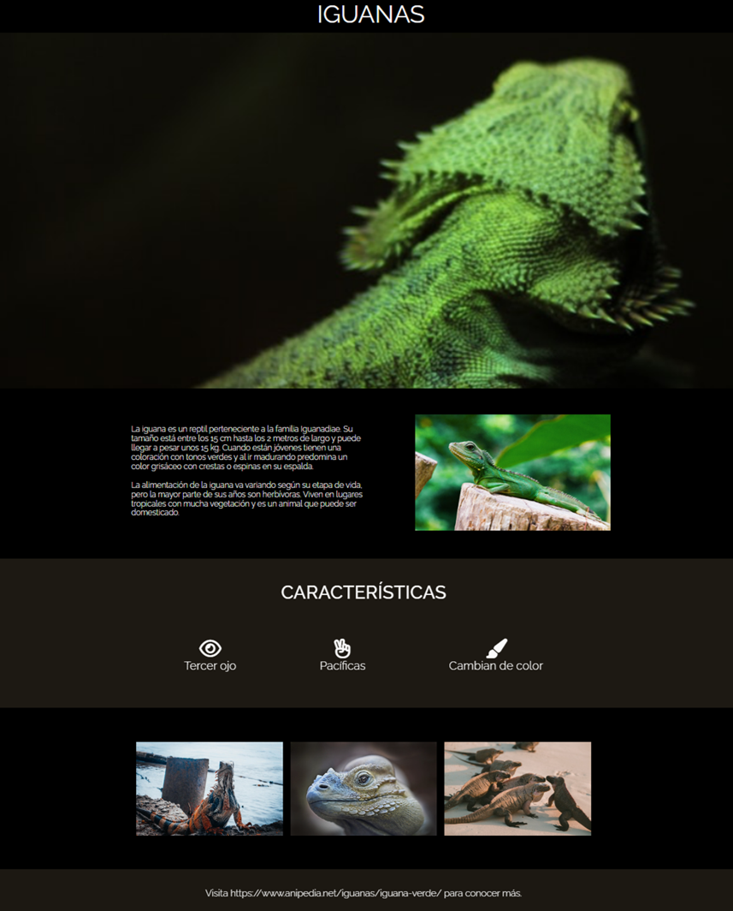

# **BASIC TEMPLATE WITH AN IGUANA THEME**

## **Description**
This web page focuses on showcasing and promoting iguanas through a visually appealing design and multimedia elements.

## **Technologies Used**
HTML5 and CSS3

## **Features**
1. **Visually appealing design:**
   - Iguana images as central elements of the design.
   - Custom background using `bg-header.jpg`.
2. **Custom styles:**
   - Colors and styles tailored to the iguana theme.
3. **Simple navigation:**
   - A single-view web page focused on visual content.

## Screenshots
<p align="center">
  
</p>


## **Installation**
1. Clone the repository:
   ```bash
   git clone https://github.com/yadicep/basic_template_iguana.git
